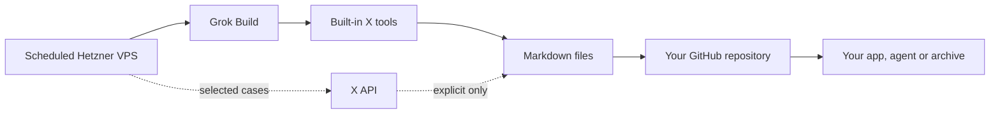

# X reads from Grok on Hetzner

Run scheduled, read-only X monitoring from a Hetzner VPS through Grok Build.
Grok Build is available with eligible SuperGrok and X Premium Plus plans. Its
usage draws from the subscription allowance, so this path does not create a
separate X Developer API charge.

This repository is both a reference implementation and a GitHub template. Create
a private repository from it when the collected posts are private.

## Choose a setup route

- give [`MEGA_PROMPT.md`](MEGA_PROMPT.md) to a capable coding agent
- follow the commands in [`SETUP.md`](SETUP.md)

Both routes install the same files and must pass the same verification checks.

## How it works



The Grok path is the default. The X API is an optional, explicit input. A Grok
failure never falls back to the metered API.

The template's job ends when the files reach your repository's `main` branch.
You decide what uses them next. It could be an agent, search index, notes system,
data importer, static site or archive.

## How safe publishing works

The simple diagram hides one safety step. The VPS does not write directly to
`main`. It pushes new files to a temporary candidate branch.

A GitHub Actions workflow checks the candidate using trusted code from `main`.
It accepts new Markdown files, deduplicates identical files and rejects
collisions or changes outside `raw/x/`. It then commits accepted files to
`main` and deletes the candidate branch.

This design keeps the public journey simple while preventing an automated VPS
from changing code, workflows or existing content.

## Run each X tool headlessly

The commands below use this real post from Elon Musk:

<https://x.com/elonmusk/status/2078289996323148076>

The post ID is `2078289996323148076`. Grok returned `@elonmusk` as the author and
`Sat, 18 Jul 2026 01:25:22 GMT` as the creation time. The post starts: “Our 2T
model, which is better than our 1.5T in every way, will finish initial training
next week.”

These examples were verified with Grok Build 0.2.102 on 18 July 2026. Set the
shared safety flags once in Bash:

```bash
GROK_X_FLAGS=(
  --always-approve
  --sandbox strict
  --output-format json
  --no-memory
  --no-subagents
  --no-plan
  --max-turns 4
  --disable-web-search
  --deny 'Bash(*)'
  --deny 'Edit(*)'
  --deny 'Read(*)'
  --deny 'Grep(*)'
  --deny 'WebFetch(*)'
  --deny 'MCPTool(*)'
)
```

### Fetch a post and its thread

Use `x_thread_fetch` when you already have a post ID:

```bash
grok -p 'Use x_thread_fetch exactly once with post_id 2078289996323148076. Return the exact post ID, author handle, full post text, creation time, and URL. Do not use any other tool or summarize.' \
  "${GROK_X_FLAGS[@]}"
```

This returned post ID `2078289996323148076` from `@elonmusk`.

### Find a post with an exact query

Use `x_keyword_search` for X operators such as `from:`, `since:` and
`-is:retweet`:

```bash
grok -p 'Use x_keyword_search exactly once in Latest mode with this query: from:elonmusk since:2026-07-18 "Our 2T model" -is:retweet. Return post IDs, author handles, creation times, full text, and URLs. Do not use any other tool or summarize.' \
  "${GROK_X_FLAGS[@]}"
```

This returned post ID `2078289996323148076` from `@elonmusk`.

### Find a post by meaning

Use `x_semantic_search` when you know the subject but not the exact wording:

```bash
grok -p 'Use x_semantic_search exactly once to find the Elon Musk post about a 2T model finishing initial training and possibly exceeding Kimi. Return post IDs, author handles, creation times, full text, and URLs. Do not use any other tool or summarize.' \
  "${GROK_X_FLAGS[@]}"
```

The results included post ID `2078289996323148076` from `@elonmusk`.

### Find an X account

Use `x_user_search` to resolve a person or organisation to an account:

```bash
grok -p 'Use x_user_search exactly once to find the official Elon Musk account. Return candidate handles and user IDs. Identify the official account from the tool result. Do not use any other tool.' \
  "${GROK_X_FLAGS[@]}"
```

This returned `@elonmusk` with user ID `44196397`. It also returned similarly
named accounts, so callers must keep the selected user ID rather than trusting a
display name alone.

Each command prints the Grok CLI JSON envelope, including `text`, `sessionId`
and usage. The worker's
[`grok_search.py`](x_grok_reader/grok_search.py) adapter adds a JSON Schema when
it needs a stable `posts` array for automation.

## Security model

The installer creates 3 system users:

- `xreader-worker` orchestrates each run
- `xreader-grok` can read only the Grok authentication file
- `xreader-submit` can read only the repository deploy key

All post content, temporary checkouts and Grok session files live below
`/run/x-grok-reader`. On Ubuntu, `/run` is tmpfs. The worker removes its runtime
directory after GitHub has accepted the candidate branch.

GitHub stores pending submissions as `ingest/hetzner/<run-id>` branches. A
scheduled workflow uses code from `main` to validate them. Candidates may only
add UTF-8 Markdown files below `raw/x/`. They cannot change code, workflows or
existing raw files.

## What the template includes

- a constrained Grok Build X-search adapter with structured output
- TOML query configuration
- Markdown normalization
- append-only candidate submission and hash verification
- a trusted GitHub publisher workflow
- a hardened oneshot systemd service and timer
- an installer with separate credentials and no listening ports
- offline tests using the Python standard library

## Requirements

- a Hetzner VPS running Ubuntu 24.04 or a compatible systemd distribution
- Python 3.11 or later
- Git and OpenSSH
- a Linux Grok Build binary and an eligible authenticated subscription
- a GitHub repository created from this template
- a write-enabled deploy key scoped only to that repository

No runtime Python packages are required.

## Important limits

Grok Build's X tools are read-only. This project does not post, like, follow,
send messages or manage an X account.

X tool availability and subscription terms can change. Check the official
[Grok Build guide](https://docs.x.ai/build/overview),
[Grok Build announcement](https://x.ai/news/grok-build-cli) and
[subscription usage guidance](https://docs.x.ai/grok/faq) before installing.
This project is not affiliated with X, xAI, Grok or Hetzner.

## Licence

MIT. See [`LICENSE`](LICENSE).
